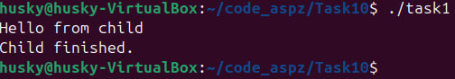

# PR10-11

## 12 варіант
### Для виконання цієї роботи, треба було через fork() створити дочірній процес та змусити його викликати команду "echo Hello from child" (надрукувати повідомлення у консоль) за допомогою команди execlp()
### Команда execlp() представляє собою системну функцію у мові С, яка використовується для заміни поточного процесу, у якому вона була викликана, іншим ("вбиваючи" попредній). За аргументи ф-ція бере спочатку команду, яка буде викликатися, потім, зазвичай, ця команда знову повторюється (аналогічно до arg[0]), потім вже йдуть аргументи команди, а в кінці обов'язково має бути NULL, як завершення команди.<br>Наприклад:  execlp("echo", "echo", "Hello", NULL);
### Код завдання:
```
#include <stdio.h>
#include <stdlib.h>
#include <unistd.h>
#include <sys/types.h>
#include <sys/wait.h>

int main() {
    pid_t pid = fork();

    if (pid < 0) {
        // fork() failed
        perror("fork failed");
        exit(EXIT_FAILURE);
    } else if (pid == 0) {
        // Child process
        // Change current father process by echo command
        execlp("echo", "echo", "Hello from child", (char *)NULL); // kill other processes

        // if execlp return code execution here - there is error
        perror("execlp failed");
        exit(EXIT_FAILURE);
    } else {
        // Parent process
        wait(NULL);  // Wait for the child process to end
        printf("Child finished.\n");
    }

    return 0;
}
```

### Результат:

### Як бачимо, вивівся як текст Hello child, так і текст child finished з бітьківського процесу